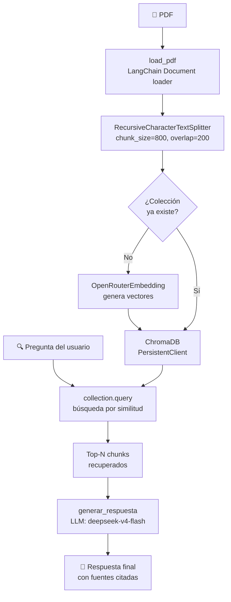

# RAG Básico — Pipeline RAG con ChromaDB + OpenRouter

Pipeline **RAG (Retrieval-Augmented Generation)** de principio a fin: carga un PDF, lo trocea, lo indexa en una base de datos vectorial, recupera fragmentos relevantes ante una pregunta y genera una respuesta con un LLM.

## 📐 Diagrama de flujo



## 🔧 Cómo funciona, paso a paso

### 1. Carga del PDF (`load_pdf`)
Usa la función de `pdf_loader.py` (basada en LangChain) para extraer el texto de cada página del PDF. Devuelve una lista de objetos `Document`, cada uno con `page_content` (el texto) y `metadata` (fuente, número de página, etc.).

### 2. División en chunks (`RecursiveCharacterTextSplitter`)
Parte cada página en fragmentos más pequeños con:
- **`chunk_size=800`**: cada chunk tiene ~800 caracteres.
- **`chunk_overlap=200`**: solapamiento de 200 caracteres entre chunks consecutivos, para no perder contexto en los bordes.

### 3. Embeddings + ChromaDB
- Usa `OpenRouterEmbedding` (definido en `openrouter_embedding.py`) para convertir cada chunk de texto en un vector numérico usando el modelo `openai/text-embedding-3-small`.
- Almacena los vectores en **ChromaDB** (base de datos vectorial) de forma persistente en la carpeta `./chroma_db`.
- Si la colección ya existe, la reutiliza; si se pasa `--force-reindex`, la borra y la recrea desde cero.

### 4. Consulta (retrieval)
Convierte la pregunta del usuario a vector con el mismo modelo de embedding y busca los `--n-results` chunks más similares en ChromaDB (por defecto 5).

### 5. Generación de respuesta (`generar_respuesta`)
- Construye un prompt que incluye el contexto recuperado (con indicadores `[Fuente N]`) y la pregunta.
- Llama a la API de OpenRouter con el modelo `deepseek/deepseek-v4-flash`.
- **Post-procesado**: detecta qué fuentes aparecen citadas en la respuesta y añade un bloque final con las referencias reales (nombre del archivo + página), no solo `[Fuente N]`.

### 6. Función auxiliar (`limpiar`)
Normaliza el texto eliminando espacios múltiples y saltos de línea sobrantes antes de indexar.

## 🚀 Uso

```bash
# Solo cargar y previsualizar el PDF (usa la pregunta por defecto)
python test_load_pdf.py sample.pdf

# Con una pregunta personalizada
python test_load_pdf.py sample.pdf --query "¿Cuáles son los ejes del plan?"

# Forzar reindexado (borra la colección anterior)
python test_load_pdf.py sample.pdf --force-reindex

# Cambiar el número de chunks recuperados
python test_load_pdf.py sample.pdf --n-results 8
```

## ⚙️ Argumentos

| Argumento | Default | Descripción |
|---|---|---|
| `pdf_path` | *(obligatorio)* | Ruta al archivo PDF |
| `--query` | `"¿Cuál es la misión del plan Gazteria?"` | Pregunta para el RAG |
| `--preview-chars` | `500` | Caracteres a mostrar por página en la vista previa |
| `--force-reindex` | `false` | Borra colección existente y re-indexa |
| `--n-results` | `5` | Nº de chunks a recuperar |
| `--embedding-model` | `openai/text-embedding-3-small` | Modelo de embeddings |
| `--collection` | `plan_donostia_gazteria` | Nombre de la colección en ChromaDB |

## 🔑 Requisitos

- Archivo `.env` con la variable `OPENROUTER_API_KEY`.
- Dependencias: `chromadb`, `langchain_text_splitters`, `python-dotenv`, `requests`, y los módulos locales `pdf_loader` y `openrouter_embedding`.

## 📂 Estructura del proyecto

```
rag-basico/
├── test_load_pdf.py          # Pipeline RAG principal
├── pdf_loader.py             # Carga de PDFs con LangChain
├── openrouter_embedding.py   # Embeddings vía OpenRouter API
├── rag_basico.py             # Versión básica del RAG
├── bare_minimum.py           # Ejemplo mínimo
├── simpletextsplitter.py     # Splitter de texto simple
├── separate.py               # Utilidad de separación
├── split_cols.py             # Split por columnas
├── requirements.txt          # Dependencias del proyecto
├── ejercicios.md             # Ejercicios
└── README.md                 # Este archivo
```
