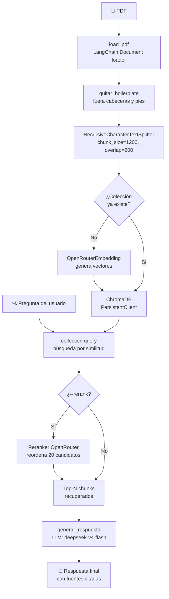

# RAG Básico — Pipeline RAG con ChromaDB + OpenRouter

Pipeline **RAG (Retrieval-Augmented Generation)** de principio a fin: carga un PDF, lo trocea, lo indexa en una base de datos vectorial, recupera fragmentos relevantes ante una pregunta y genera una respuesta con un LLM.

## 📐 Diagrama de flujo


```mermaid
flowchart TD
    A[📄 PDF] --> B[load_pdf<br/>LangChain Document loader]
    B --> B2[quitar_boilerplate<br/>fuera cabeceras y pies]
    B2 --> C[RecursiveCharacterTextSplitter<br/>chunk_size=1200, overlap=200]
    C --> D{¿Colección<br/>ya existe?}
    D -->|No| E[OpenRouterEmbedding<br/>genera vectores]
    E --> F[ChromaDB<br/>PersistentClient]
    D -->|Sí| F
    G[🔍 Pregunta del usuario] --> H[collection.query<br/>búsqueda por similitud]
    F --> H
    H --> R{¿--rerank?}
    R -->|Sí| RR[Reranker OpenRouter<br/>reordena 20 candidatos]
    RR --> I
    R -->|No| I[Top-N chunks<br/>recuperados]
    I --> J[generar_respuesta<br/>LLM: deepseek-v4-flash]
    J --> K[📝 Respuesta final<br/>con fuentes citadas]
```

## 🔧 Cómo funciona, paso a paso

### 1. Carga del PDF (`load_pdf`)

Usa la función de `pdf_loader.py` (basada en LangChain) para extraer el texto de cada página del PDF. Devuelve una lista de objetos `Document`, cada uno con `page_content` (el texto) y `metadata` (fuente, número de página empezando en 1 como en el visor de PDF, etc.).

Después `quitar_boilerplate` elimina las cabeceras y pies que se repiten en cada página (`PLAN DONOSTIA GAZTERIA | RESULTADO`, `www.donostia.eus/gazteria`, números de página…). Si se dejan, todos los chunks se parecen a cualquier pregunta sobre «el plan Gazteria». Se desactiva con `--keep-boilerplate`.

### 2. División en chunks (`RecursiveCharacterTextSplitter`)

Parte cada página en fragmentos más pequeños con:

- **`chunk_size=1200`**: cada chunk tiene ~1200 caracteres (`--chunk-size`).
- **`chunk_overlap=200`**: solapamiento de 200 caracteres entre chunks consecutivos, para no perder contexto en los bordes (`--chunk-overlap`).

### 3. Embeddings + ChromaDB

- Usa `OpenRouterEmbedding` (definido en `openrouter_embedding.py`) para convertir cada chunk de texto en un vector numérico usando por defecto el modelo `baai/bge-m3` (multilingüe, ver [benchmark](#-benchmark-qué-configuración-usar)).
- Almacena los vectores en **ChromaDB** (base de datos vectorial) de forma persistente en la carpeta `./chroma_db`.
- Si la colección ya existe, la reutiliza; si se pasa `--force-reindex`, la borra y la recrea desde cero.
- La configuración de indexado (PDF, modelo, chunking) se guarda en los metadatos de la colección: si cambias alguno de esos parámetros, se reindexa automáticamente.

### 4. Consulta (retrieval)

Convierte la pregunta del usuario a vector con el mismo modelo de embedding y busca los `--n-results` chunks más similares en ChromaDB (por defecto 5).

Con `--rerank MODELO` (p. ej. `cohere/rerank-v3.5`) primero se recuperan `--n-candidates` chunks (20) y un reranker de OpenRouter (`/api/v1/rerank`) los reordena leyendo pregunta y chunk juntos; se quedan los `--n-results` mejores.

### 5. Generación de respuesta (`generar_respuesta`)

- Construye un prompt que incluye el contexto recuperado (con indicadores `[Fuente N]`) y la pregunta.
- Llama a la API de OpenRouter con el modelo `deepseek/deepseek-v4-flash`.
- **Post-procesado**: detecta qué fuentes aparecen citadas en la respuesta y añade un bloque final con las referencias reales (nombre del archivo + página), no solo `[Fuente N]`.

### 6. Función auxiliar (`limpiar`)

Normaliza el texto eliminando espacios múltiples y saltos de línea sobrantes antes de indexar.

## 🚀 Uso

```bash
# Solo cargar y previsualizar el PDF (usa la pregunta por defecto)
python test_load_pdf.py sample.pdf

# Con una pregunta personalizada
python test_load_pdf.py sample.pdf --query "¿Cuáles son los ejes del plan?"

# Forzar reindexado (borra la colección anterior)
python test_load_pdf.py sample.pdf --force-reindex

# Cambiar el número de chunks recuperados
python test_load_pdf.py sample.pdf --n-results 8

# Modo interactivo: varias preguntas seguidas sin vista previa de páginas
python test_load_pdf.py sample.pdf --interactive --preview-chars 0

# Con rerank
python test_load_pdf.py sample.pdf -i --preview-chars 0 --rerank cohere/rerank-v3.5
```

## ⚙️ Argumentos

| Argumento           | Default                                   | Descripción                                        |
| ------------------- | ----------------------------------------- | -------------------------------------------------- |
| `pdf_path`          | _(obligatorio)_                           | Ruta al archivo PDF                                |
| `--query`           | `"¿Cuál es la misión del plan Gazteria?"` | Pregunta para el RAG                               |
| `--preview-chars`   | `500`                                     | Caracteres a mostrar por página en la vista previa |
| `--force-reindex`   | `false`                                   | Borra colección existente y re-indexa              |
| `--n-results`       | `5`                                       | Nº de chunks a recuperar                           |
| `--embedding-model` | `baai/bge-m3`                             | Modelo de embeddings                               |
| `--chunk-size`      | `1200`                                    | Tamaño de chunk en caracteres                      |
| `--chunk-overlap`   | `200`                                     | Solapamiento entre chunks                          |
| `--keep-boilerplate`| `false`                                   | No quitar cabeceras/pies de página                 |
| `--rerank`          | _(ninguno)_                               | Modelo de rerank, p. ej. `cohere/rerank-v3.5`      |
| `--n-candidates`    | `20`                                      | Chunks recuperados antes del rerank                |
| `--collection`      | `plan_donostia_gazteria`                  | Nombre de la colección en ChromaDB                 |
| `--interactive`, `-i` | `false`                                 | Pide preguntas en bucle (ignora `--query`)         |

## 📊 Benchmark: qué configuración usar

`bench_rag.py` evalúa el retrieval con 15 preguntas sobre `cas-plan-donostia-gazteria-2025-2027.pdf` cuya página correcta se conoce (misión, valores, retos, encuestas, evaluación…). Métricas:

- **hit@k**: % de preguntas cuya página correcta está entre los k primeros chunks.
- **MRR**: media de 1/posición del primer chunk correcto (1 = siempre el primero).
- **Pos. misión**: posición del chunk con la misión para «¿Cuál es la misión del plan Gazteria?».

```bash
python bench_rag.py                       # 11 modelos × 3 chunkings × con/sin limpieza
python bench_rag.py --models baai/bge-m3 --chunk 1200:200 --clean si --rerank
```

Resumen (octubre 2026, precios de OpenRouter; el coste por consulta no incluye la llamada al LLM):

| Configuración | Modelo embeddings | Chunk | Limpieza | Rerank | hit@1 | hit@3 | hit@5 | MRR | Pos. misión | Indexar PDF ($) | Consulta ($) | Latencia retrieval |
|---|---|---|---|---|---|---|---|---|---|---|---|---|
| Anterior | openai/text-embedding-3-small | 800:200 | no | — | 73% | 73% | 80% | 0.75 | **19** ❌ | 0.00026 | ~0 | 0.05 s |
| **Por defecto** ✅ | baai/bge-m3 | 1200:200 | sí | — | 80% | 93% | 93% | 0.86 | 3 | **0.00009** | ~0 | **0.08 s** |
| Alternativa | qwen/qwen3-embedding-4b | 800:200 | sí | — | 80% | 93% | 93% | 0.86 | 3 | 0.00025 | ~0 | 0.10 s |
| Calidad máx. | baai/bge-m3 | 1200:200 | sí | cohere/rerank-v3.5 | **93%** | 93% | 93% | **0.94** | **1** | 0.00009 | 0.001 | 0.5 s |
| Rerank barato | baai/bge-m3 | 1200:200 | sí | voyageai/rerank-2.5-lite | 93% | 93% | **100%** | 0.95 | 5 | 0.00009 | 0.0001 | 0.4 s |
| Rerank caro | baai/bge-m3 | 1200:200 | sí | qwen/qwen3-reranker-8b | 87% | **100%** | 100% | 0.93 | 2 | 0.00009 | 0.0014 | 0.9 s |
| Modelo grande | openai/text-embedding-3-large | 800:200 | sí | — | 73% | 87% | 93% | 0.82 | 3 | 0.0016 | ~0 | 0.05 s |

Conclusiones:

- **El modelo de embeddings era el problema principal.** `text-embedding-3-small` dejaba la misión en el puesto 19. `bge-m3` (multilingüe) la sube al 3.º, cuesta 3 veces menos y queda dentro de `--n-results 5`.
- **Quitar cabeceras y pies** mejora casi todos los modelos (p. ej. `text-embedding-3-large`: MRR 0.79 → 0.82, hit@3 80% → 87%).
- **Tamaño de chunk**: no hay un ganador claro. 1200 da menos chunks (44) y con más contexto. 400 ayuda a unos modelos (voyage) y perjudica a otros (qwen, gemini, 3-small).
- **Rerank**: con él, el modelo de embeddings casi deja de importar (los 20 candidatos ya contienen la página buena) y el primer resultado es mucho más fiable. Pero cuesta unas 10–100 veces más por consulta que los embeddings, suma ~0,4 s y **no siempre acierta**: `cohere/rerank-v3.5` saca del top 5 la pág. 8 de «¿Qué valores tiene el departamento?», porque esa lista apenas contiene la palabra «valores». Por eso va como opción y no por defecto.
- Con solo 15 preguntas, una diferencia de un 7% equivale a una pregunta: compara tendencias, no décimas.

## 🔑 Requisitos

- Archivo `.env` con la variable `OPENROUTER_API_KEY`.
- Dependencias: `chromadb`, `langchain_text_splitters`, `python-dotenv`, `requests`, y los módulos locales `pdf_loader` y `openrouter_embedding`.

## 📂 Estructura del proyecto

```
rag-basico/
├── test_load_pdf.py          # Pipeline RAG principal
├── bench_rag.py              # Benchmark chunking × embeddings × rerank
├── pdf_loader.py             # Carga de PDFs con LangChain
├── openrouter_embedding.py   # Embeddings vía OpenRouter API
├── rag_basico.py             # Versión básica del RAG
├── bare_minimum.py           # Ejemplo mínimo
├── simpletextsplitter.py     # Splitter de texto simple
├── separate.py               # Utilidad de separación
├── split_cols.py             # Split por columnas
├── requirements.txt          # Dependencias del proyecto
├── ejercicios.md             # Ejercicios
└── README.md                 # Este archivo
```
